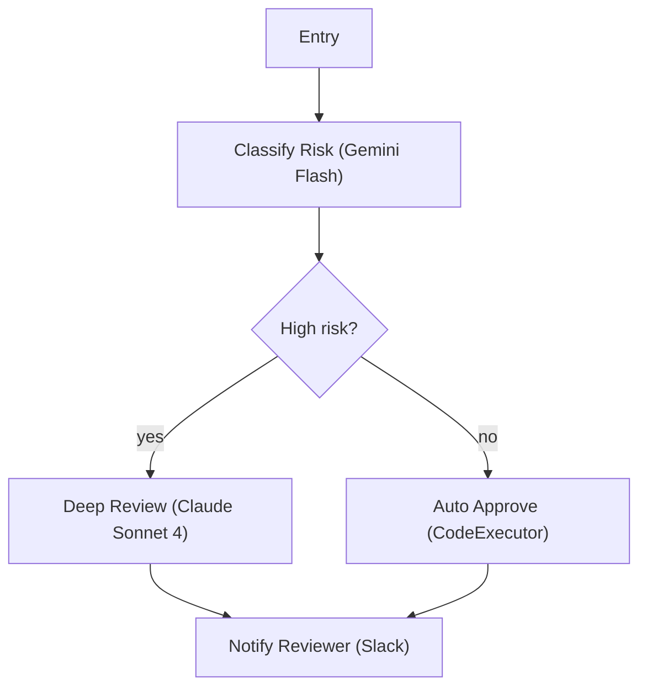

# Phase 3 — Review

> **On entry:** display the phase timeline — Phase 3 row (`✅ Intake  ──  ✅ Design  ──  ● Review  ──  ○ Build  ──  ...`).

**Goal:** give the user a complete, plain-English picture of exactly what will be built — before a single API call is made.

**Exit criteria:** the user has typed `build`. Nothing deploys before that word.

---

## Step 1 — Show the Mermaid diagram

Render the chosen architecture as a `graph TD` Mermaid diagram. Use:
- `[]` for execution nodes (label includes model)
- `{}` for condition nodes
- `(())` for waiting / looping nodes
- Edge labels for condition branches; no label for unconditional edges



---

## Step 2 — Show the node table

| # | Node | Tool kind | Model | Key inputs | Consent | Est. credits |
|---|------|-----------|-------|------------|---------|---------|--------------|
| 0 | Entry | — | — | — | — | — | — |
| 1 | Classify Risk | Custom GPT | GEMINI_25_FLASH | record (ai_fill) | no | STOP | ~2 |
| 2 | Deep Review | Custom GPT | BEDROCK_CLAUDE_SONNET_4 | record (linked), risk (linked) | yes | STOP | ~5 |
| 3 | Auto Approve | CodeExecutor | — | risk_tier (linked) | no | STOP | ~1 |
| 4 | Notify Reviewer | Slack (real) | — | message (ai_fill) | yes | STOP | ~1 |

`Consent: yes` on any node that writes to an external system.

---

## Step 3 — Show cost at volume

```
💰 COST AT [volume]  ·  1 credit = $0.10 Pro · $0.049 Enterprise
   [X] cr/task   $[X]/week   $[X]/month   $[X]/year
```

If volume was not stated, show at two assumptions (e.g. 50/day and 200/day).

---

## Step 4 — State 5 display

Render the full review block. See `references/ux-flow.md` State 5 for the exact template.

The block must include:
- What the agent does in plain English (2–3 sentences, no node jargon)
- The flow diagram and node table
- Cost at volume
- The KPI or goal the design is optimised for

---

## Step 5 — Wait for `build`

End with:

```
────────────────────────────────────────────────────
 Happy with this?
 Type 'build' to create in Beam, or describe a change.
────────────────────────────────────────────────────
```

**Only `build` proceeds.** If the user describes a change, update the design and re-show this entire review block. "Yes", "looks good", "go ahead", "ok", "sure" do not proceed to deploy.

---

## Exit gate

- [ ] Mermaid diagram shown for chosen option
- [ ] Node table shown with tool kind, model, consent, credits
- [ ] Cost at volume shown
- [ ] Full State 5 review block rendered
- [ ] User typed `build`

→ Proceed to `phases/4-build.md`
